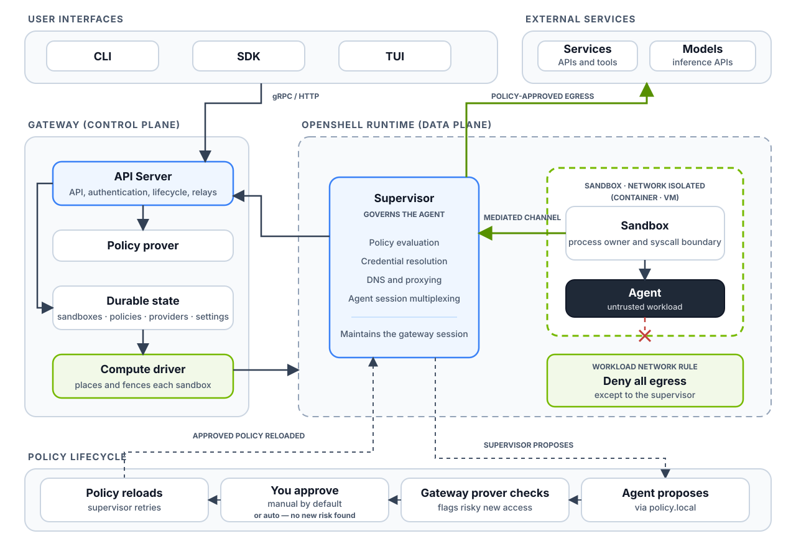

# Introduction

A coding agent runs commands, reads files and talks to the internet on your behalf.
It does so with all the permissions of the user who started it.
Instructions hidden in anything it reads can make it do harm.

You can't reliably prevent the agent from being tricked.
You can limit what it can do when it is.
The rule of this workshop: **the agent gets only the access its task needs, and never sees your real credentials**.

## Risks

- **Untrusted code execution** – the agent generates code and runs it in the environment it operates in.
- **Data exfiltration** – the agent uploads source code or confidential data to unauthorized destinations.
- **Credential theft** – the agent reads local secrets, such as SSH keys or cloud credentials.
- **Privilege escalation** – the agent tries `sudo`, works around allow and deny rules, or gets into resources it shouldn't.

## Sources of risk

- **Prompt injection** – instructions hidden in what the agent reads: local files, fetched web pages, search results, installed dependencies.
- **Supply-chain attack** – the agent installs a compromised dependency that runs malicious code.
- **Honest mistake** – the agent misunderstands a goal given in natural language.

## Incidents

- [Replit agent deleted a user's production database](https://www.theregister.com/software/2025/07/21/vibe-coding-service-replit-deleted-production-database/719783)
- [OpenAI agent breached into Australia's national health insurance program](https://en.wikipedia.org/wiki/OpenAI_rogue_agent_breach_of_Medicare)
- [Supply-chain attack on a trusted npm package leaked secrets on GitHub](https://www.wiz.io/blog/s1ngularity-supply-chain-attack)
- [AI agents uploaded user-provided images to third-party image hosting](https://www.bleepingcomputer.com/news/artificial-intelligence/openais-ai-agents-accidentally-uploaded-user-provided-images-to-third-party-sites/)
- [Claude Code bypassed its denylist and disabled its sandbox](https://ona.com/stories/how-claude-code-escapes-its-own-denylist-and-sandbox)

## OpenShell

OpenShell is a runtime from NVIDIA that runs agents in sandboxes and controls what they can access.

- **Sandbox** – a container or VM where the agent runs. It's isolated from the network and can reach only the supervisor.
- **Supervisor** – runs next to each sandbox, outside of it. Governs the agent: evaluates the policy, resolves credentials and proxies network traffic.
- **Provider** – a stored credential, together with the network rules it needs.
- **Gateway** – the control plane. Keeps the state of sandboxes, policies and providers.
- **Compute driver** – creates sandboxes with a runtime: Docker, Podman, MicroVM or Kubernetes.

## Workshop outline

You will build a sandbox where an agent works on your GitHub repository and can't reach anything else.

| # | Chapter | What you do |
|---|---|---|
| 2 | [Gateway and drivers](../02-gateway-and-drivers/README.md) | Check the control plane and pin the Docker driver. |
| 3 | [Sandboxes](../03-sandboxes/README.md) | Create sandboxes and manage their lifecycle. |
| 4 | [Custom base image](../04-custom-base-image/README.md) | Build an image with tools and agents. |
| 5 | [Providers and profiles](../05-providers-and-profiles/README.md) | Give access to a single repository without exposing your token. |
| 6 | [Custom policy](../06-custom-policy/README.md) | Allow the agent to reach its LLM provider and save the policy. |

## Further reading

- [OWASP Top 10 for LLM applications](https://genai.owasp.org/llm-top-10/)
- [OpenShell overview](https://docs.nvidia.com/openshell/latest/about/overview)
- [OpenShell architecture](https://docs.nvidia.com/openshell/latest/about/architecture)

## Next chapter

[Gateway and drivers](../02-gateway-and-drivers/README.md)
