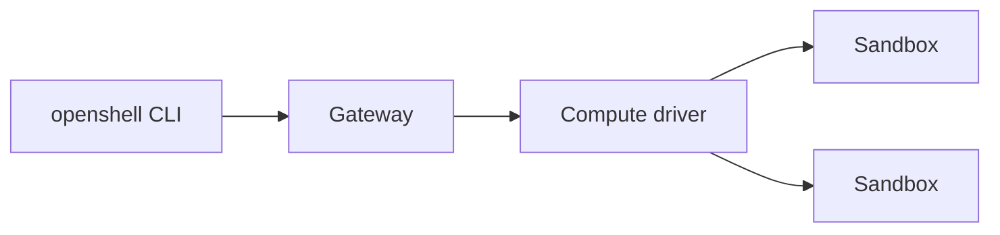

# Gateway and drivers

## Goal

Check that the OpenShell gateway runs and creates sandboxes with Docker.

## Official docs

- [Gateways overview](https://docs.nvidia.com/openshell/latest/how-it-works/gateways/overview)
- [Sandbox runtimes](https://docs.nvidia.com/openshell/latest/how-it-works/sandboxes/runtimes)

## Key concepts

### Gateway

The gateway is the control plane of OpenShell.
It runs as a background service and keeps the state of your sandboxes, providers and policies.
The command-line tool doesn't create sandboxes itself, it sends requests to the gateway.

A gateway can run locally on your computer or remotely, for example in a Kubernetes cluster.
In this workshop, you use a local gateway.

### Compute driver

The gateway doesn't run sandboxes directly.
It uses a compute driver, which creates sandboxes with a specific runtime.

| Driver | Sandbox runs as | Use it for |
|---|---|---|
| Docker | container | the most common setup, used in this workshop |
| Podman | rootless container | containers without a root daemon |
| MicroVM | lightweight virtual machine | stronger isolation, the sandbox doesn't share the kernel with the host |
| Kubernetes | pod in a cluster | remote and shared deployments |

If you don't choose a driver, the gateway picks the first one available, in this order: Kubernetes, Podman, Docker.
It never picks MicroVM automatically.

### Request flow



## Instructions

### 1. Check that the gateway runs

The local gateway runs as a systemd user service called `openshell-gateway`.
Check its status.

🖥️ Host

```shell
systemctl --user status openshell-gateway
```

The service is `active (running)`.
If it isn't, start it with `systemctl --user start openshell-gateway`.

> [!TIP]
> When the gateway commands fail, check the gateway logs:
> ```shell
> journalctl --user -u openshell-gateway -f
> ```
> Stop following with <kbd>Ctrl</kbd>+<kbd>C</kbd>.

### 2. Inspect the gateway

List the gateways that the CLI knows, then show the details of the active one.

🖥️ Host

```shell
openshell gateway list
openshell gateway info
```

`list` shows one local gateway.
`info` shows, among other details, the compute drivers that the gateway initialized.

### 3. Pin the Docker driver

If you have both Podman and Docker installed, the gateway picks Podman.
The workshop instructions are written for Docker.
It's recommended to pin the compute driver to Docker.

Open `~/.config/openshell/gateway.toml` in an editor, or create it if it doesn't exist, and set the compute driver:

🖥️ Host

```toml
[openshell]
version = 2

[openshell.gateway]
compute_driver = "docker"
```

Restart the gateway to apply the change, then check the drivers again.

🖥️ Host

```shell
systemctl --user restart openshell-gateway
openshell gateway info
```

`info` shows the Docker driver.

## Target state

- [ ] The `openshell-gateway` service runs.
- [ ] `openshell gateway info` shows the Docker driver.

## Next chapter

[Sandboxes](../03-sandboxes/README.md)
