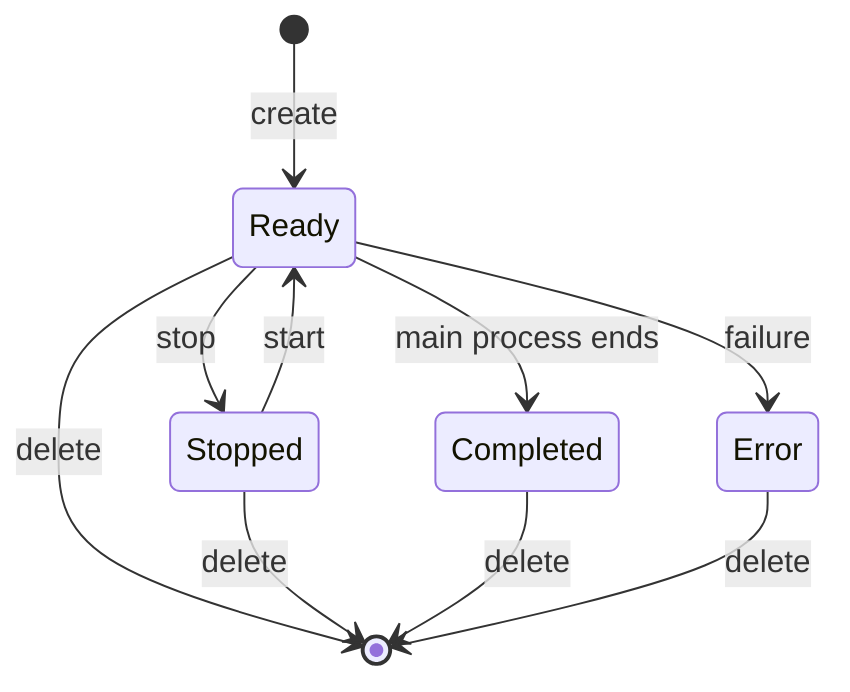

# Sandboxes

## Goal

Create a sandbox, run commands in it and manage its lifecycle.

## Official docs

- [Sandboxes overview](https://docs.nvidia.com/openshell/latest/how-it-works/sandboxes/overview)
- [Default policy](https://docs.nvidia.com/openshell/latest/how-it-works/policies/default-policy)

## Key concepts

### Host and sandbox

You work in two places:
- 🖥️ **Host** – your computer. You create and manage sandboxes from here.
- 📦 **Sandbox** – an isolated container with its own filesystem and processes. The agent runs here.

Each command block in the instructions says where to run it.

### Policy

A policy decides what processes in the sandbox can access.
If you don't provide your own policy, the sandbox uses the default policy.
The default policy blocks all network access.
You allow only the destinations the agent needs.

### Main process

Every sandbox has a main process, the first process that starts in it.
The sandbox lives as long as its main process runs.
You can attach your terminal to the main process and detach from it, and the process keeps running.

When the main process ends successfully, the sandbox is completed.
When the main process fails, the sandbox is in error.

You can also run more processes next to the main process.
They don't affect the lifecycle of the sandbox.

### Persistent and ephemeral sandboxes

A **persistent** sandbox keeps its files and logs until you delete it.
You can stop it, start it again and continue where you left off.
Use it for long-running work, for example an agent working on your repository.

An **ephemeral** sandbox is deleted automatically, together with its files and logs, when its main process ends.
Use it for one-off tasks and experiments.

### Sandbox lifecycle



> [!WARNING]
> The official docs mention that you can start a completed sandbox or a sandbox in error again.
> It doesn't work at the time of writing this workshop.

## Instructions

### 1. Create a named sandbox

Create a persistent sandbox called `my-sandbox`.
OpenShell opens a shell inside it.

🖥️ Host

```shell
openshell sandbox create --name my-sandbox
```

This shell is the main process of the sandbox.
The name lets you refer to the sandbox in the next commands.

### 2. Look around

Explore the sandbox and create a file that you will look for later.

📦 Sandbox

```shell
whoami
pwd
uname -a
touch hello.txt
```

- `whoami` shows that you are not root.
- `pwd` shows the working directory, where the agent works and can write files.
- `uname -a` shows the kernel of your host. The sandbox is a container, so it shares the kernel with the host.

### 3. Detach from the sandbox

Detach from the main process with <kbd>Ctrl</kbd>+<kbd>P</kbd>, then <kbd>Ctrl</kbd>+<kbd>Q</kbd>.

You are back on the host and the shell keeps running in the sandbox.

> [!WARNING]
> Don't use `exit` or <kbd>Ctrl</kbd>+<kbd>D</kbd>.
> They end the main process and the sandbox becomes completed.

### 4. Inspect the sandbox

List all your sandboxes with their status, then show the details of `my-sandbox`.

🖥️ Host

```shell
openshell sandbox list
openshell sandbox get my-sandbox
```

The status of `my-sandbox` is `Ready`, because its main process still runs.

### 5. Run commands without connecting

Start new processes in the sandbox, next to the main process.

🖥️ Host

```shell
# One-shot command
openshell sandbox exec --name my-sandbox -- uname -a

# New independent shell
openshell sandbox exec --name my-sandbox -- bash
```

A one-shot command prints its output on the host and ends, which is useful in scripts.
The new shell is independent of the main process, so you can leave it with `exit` and the sandbox keeps running.

> [!TIP]
> Without `--name`, `exec` uses the last used sandbox.

### 6. Reconnect to the main process

Attach your terminal to the main process again and check that the file from step 2 is there.

🖥️ Host

```shell
openshell sandbox connect my-sandbox
```

📦 Sandbox

```shell
ls hello.txt
```

You are back in the shell from step 1.
Detach again with <kbd>Ctrl</kbd>+<kbd>P</kbd>, then <kbd>Ctrl</kbd>+<kbd>Q</kbd>.

### 7. Check that files survive a restart

Stop the sandbox, start it again and check that the file is still there.

🖥️ Host

```shell
openshell sandbox stop my-sandbox
openshell sandbox start my-sandbox
openshell sandbox exec --name my-sandbox -- ls hello.txt
```

`stop` halts the sandbox but keeps its files and logs.
While the sandbox is stopped, you can't connect to it or run commands in it.

### 8. Clean up

Delete the sandbox together with its files and logs.

🖥️ Host

```shell
openshell sandbox delete my-sandbox
```

You can't undo it.

### 9. Try an ephemeral sandbox

`--no-keep` creates an ephemeral sandbox.

🖥️ Host

```shell
openshell sandbox create --no-keep
```

Without `--name`, OpenShell generates a name for it.

This time, end the main process with `exit`.

📦 Sandbox

```shell
exit
```

Check that the sandbox is gone.

🖥️ Host

```shell
openshell sandbox list
```

OpenShell deleted the sandbox when its main process ended.

## Target state

- [ ] You created, stopped, started and deleted a named sandbox.
- [ ] You detached from a sandbox and connected back.
- [ ] You ran commands in a sandbox with `exec`.
- [ ] `openshell sandbox list` shows no sandboxes.

## Next chapter

[Custom base image](../04-custom-base-image/README.md)
