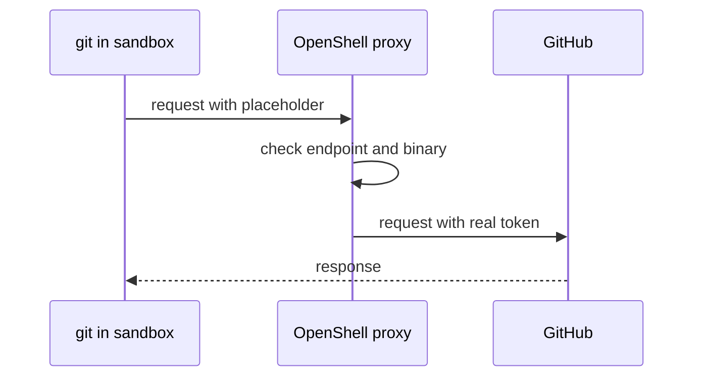

# Providers and profiles

## Goal

Give the sandbox access to a single GitHub repository without exposing your token to the agent.

## Official docs

- [Providers overview](https://docs.nvidia.com/openshell/latest/how-it-works/providers/overview)
- [Provider profiles](https://docs.nvidia.com/openshell/latest/how-it-works/providers/profiles)

## Key concepts

### Credentials in a sandbox

The agent needs credentials to work with external services, for example a token to push to GitHub.
If the agent can read the token, it can also leak it, for example after a prompt injection.

### Provider

A provider stores a credential in the gateway, outside of the sandbox.
The sandbox gets only a placeholder in an environment variable.
When a process sends a request with the placeholder, OpenShell replaces it with the real credential on the way out.
The agent never sees the real value.

### Provider profile

A profile is a template for a type of provider, for example GitHub.
It describes:
- **Credentials** – which environment variables hold the credential and how it's sent, for example as a bearer token.
- **Endpoints** – which hosts the provider can reach, optionally limited to specific HTTP methods and paths.
- **Binaries** – which programs can reach the endpoints, for example `git` and `gh`.

A provider is a profile with a concrete credential value.
When you attach a provider to a sandbox, its endpoints and binaries are added to the sandbox policy.

### Credential flow



## Instructions

In all commands, replace `<org>/<repo>` with your GitHub repository.
If you don't have one to use, fork [datamole-ai/openshell-workshop](https://github.com/datamole-ai/openshell-workshop).

### 1. Try to clone without a provider

Create an ephemeral sandbox and try to clone a public repository.

🖥️ Host

```shell
openshell sandbox create --no-keep --from openshell-workshop
```

📦 Sandbox

```shell
git clone https://github.com/NVIDIA/OpenShell.git
exit
```

The clone fails, because the default policy blocks all network access.

### 2. Import the GitHub profile

OpenShell [publishes profiles](https://github.com/NVIDIA/OpenShell/tree/main/providers) for common services.
Import the GitHub profile and make sure it's listed in the available profiles.

🖥️ Host

```shell
openshell profile import --url https://raw.githubusercontent.com/NVIDIA/OpenShell/main/providers/github.yaml --global
openshell profile list
```

The list contains `github`.

### 3. Create a GitHub token

Create a fine-grained [personal access token](https://github.com/settings/personal-access-tokens) with ([instructions](https://docs.github.com/en/authentication/keeping-your-account-and-data-secure/managing-your-personal-access-tokens#creating-a-fine-grained-personal-access-token)):
- Repository access: **Only select repositories**, pick `<org>/<repo>`.
- Permissions: **Contents** read and write.

Save the token to a file, for example `/tmp/github-token`, and load it into an environment variable.

🖥️ Host

```shell
export GITHUB_TOKEN=$(cat /tmp/github-token)
```

This way, the token doesn't end up in your shell history.

### 4. Create a provider

Create a provider of type `github` with your token.

🖥️ Host

```shell
openshell provider create --name github-broad --type github --credential GITHUB_TOKEN
```

`--credential GITHUB_TOKEN` without a value reads the token from the environment variable.

### 5. Use the provider in a sandbox

Create an ephemeral sandbox with the provider attached.

🖥️ Host

```shell
openshell sandbox create --no-keep --from openshell-workshop --provider github-broad
```

Look at the token in the sandbox.

📦 Sandbox

```shell
echo $GITHUB_TOKEN
```

It's a placeholder, not your token.

Configure `git` to send the placeholder as the password.
The [credential helper](https://git-scm.com/docs/gitcredentials) prints the username and password whenever `git` needs them.

📦 Sandbox

```shell
git config --global credential.helper '!f() { echo username=x-access-token; echo "password=$GITHUB_TOKEN"; }; f'
```

`x-access-token` is a generic username that GitHub accepts.
You can use your GitHub username instead.

Clone your repository over HTTPS and check the GitHub CLI.

📦 Sandbox

```shell
git clone https://github.com/<org>/<repo>.git
gh auth status
```

Both work.
Now clone the public repository from step 1.

📦 Sandbox

```shell
git clone https://github.com/NVIDIA/OpenShell.git
exit
```

It works too, because the `github` profile allows all of `github.com` with read-only access.
The agent could, for example, clone any public repository with malicious instructions.

### 6. Create a profile for your repository

Export the `github` profile to see what it allows.

🖥️ Host

```shell
openshell profile export github -o yaml --global > github.yaml
```

The [`github-my-repo.yaml`](./github-my-repo.yaml) profile is an edited copy that allows only your repository.
Copy it next to the exported profile.

🖥️ Host

```shell
cp chapters/05-providers-and-profiles/github-my-repo.yaml .
```

Open `github-my-repo.yaml` in your text editor and use find and replace to change `<org>/<repo>` to your repository.
Read the comments in the file to understand the changes.

The changes:
- New `id` and `display_name`.
- `api.github.com` allows only paths under `/repos/<org>/<repo>/`.
- The GraphQL endpoint is removed, because it can't be limited to one repository.
- `github.com` allows only the Git requests for clone, fetch and push of your repository.

Check the profile for errors and import it.

🖥️ Host

```shell
openshell profile lint -f github-my-repo.yaml
openshell profile import -f github-my-repo.yaml --global
```

### 7. Create a provider for your repository

Create a provider of the new type `github-my-repo`.

🖥️ Host

```shell
openshell provider create --name github-my-repo --type github-my-repo --credential GITHUB_TOKEN
```

### 8. Work with your repository

Create a persistent sandbox with the new provider.
You will use it in the next chapter too.

🖥️ Host

```shell
openshell sandbox create --name my-sandbox --from openshell-workshop --provider github-my-repo
```

Configure `git` and clone your repository.

📦 Sandbox

```shell
git config --global credential.helper '!f() { echo username=x-access-token; echo "password=$GITHUB_TOKEN"; }; f'
git config --global user.name "<your name>"
git config --global user.email "<your email>"
git clone https://github.com/<org>/<repo>.git
```

The public repository is blocked now.

📦 Sandbox

```shell
git clone https://github.com/NVIDIA/OpenShell.git
```

Commit a change on a temporary branch and push it to your repository.

📦 Sandbox

```shell
cd <repo>
git switch -c openshell-test
echo "Hello from OpenShell" > hello.txt
git add hello.txt
git commit -m "Add hello.txt"
git push -u origin openshell-test
```

If `git push` works, the agent can push too.

Detach with <kbd>Ctrl</kbd>+<kbd>P</kbd>, then <kbd>Ctrl</kbd>+<kbd>Q</kbd>.

> [!NOTE]
> Some `gh` commands use the GraphQL API, which the new profile blocks.
> To let the agent work with GitHub, for example to create pull requests, instruct it to call the REST API with `gh api`.

> [!TIP]
> Set up the credential helper in the Dockerfile, so you don't have to configure it in every sandbox.

## Target state

- [ ] The `github-my-repo` profile allows only your repository.
- [ ] `my-sandbox` runs with the `github-my-repo` provider.
- [ ] In `my-sandbox`, you cloned your repository and pushed a commit to it.
- [ ] In `my-sandbox`, the clone of a public repository failed.

## Next chapter

[Custom policy](../06-custom-policy/README.md)
