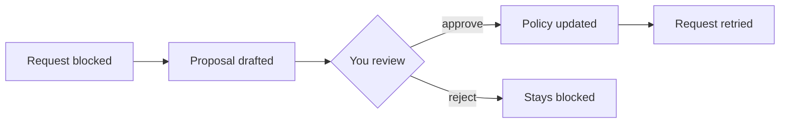

# Custom policy

## Goal

Allow your agent to reach its LLM provider, and save the policy for future sandboxes.

## Official docs

- [Policies overview](https://docs.nvidia.com/openshell/latest/how-it-works/policies/overview)
- [Network rules](https://docs.nvidia.com/openshell/latest/how-it-works/policies/network-rules)
- [Policy advisor](https://docs.nvidia.com/openshell/latest/how-it-works/policies/advisor)

## Key concepts

### Base and effective policy

The base policy is the policy you choose for the sandbox, or the default policy if you don't choose any.
Attached providers add their own network rules to it.
The effective policy combines the base policy with the provider rules, and it's the policy the sandbox enforces.

> [!CAUTION]
> A provider keeps adding its rules even if the base policy is stricter.
> That's why you narrowed the GitHub profile itself in the previous chapter.
> To restrict what a provider allows, edit its profile.

### Network rules

A network rule allows a set of programs to reach a set of endpoints.
OpenShell checks two levels:
- **L4 (transport layer)** – host, port and program. This is the default.
- **L7 (application layer)** – also the content of the request, for example HTTP method and path. You enable it by setting the protocol of the endpoint, for example `rest`.

With L7, an endpoint can have rules that allow only specific HTTP methods and paths.
By default, the enforcement is `audit`, so a request that matches no rule is logged but still allowed.
To block such requests, set the enforcement to `enforce`.
In both modes, endpoints that aren't in the policy stay blocked.

OpenShell identifies a program by the real path of its executable, after resolving symbolic links and scripts.
For example, `pip` is a Python script, so the program that connects to PyPI is the Python interpreter.

### Denied requests and proposals

When OpenShell blocks a request, it logs it and drafts a proposal, a network rule that would allow the request.
You review the proposals and approve the ones you want.
An approved rule takes effect immediately.



## Instructions

Use two terminals, one connected to `my-sandbox` and one on the host.

### 1. Inspect the policy

Show the base policy of `my-sandbox`, then the effective policy.

🖥️ Host

```shell
openshell policy get my-sandbox --base
openshell policy get my-sandbox --full
```

The base policy is the default policy.
The effective policy also contains the rules of the `github-my-repo` provider.

### 2. Try to log in to the agent

Connect to the sandbox and start the agent of your choice.

🖥️ Host

```shell
openshell sandbox connect my-sandbox
```

📦 Sandbox

```shell
claude    # or: opencode, copilot
```

The agent most likely fails to start.
If not, logging in definitely fails.
The policy blocks the API of the LLM provider.

### 3. Find the denied requests

Look at the sandbox logs.

🖥️ Host

```shell
openshell logs my-sandbox
```

Look for `WARN` or OCSF events.
They show the host, port and program of each denied request.

### 4. Review the proposals

List the proposals that OpenShell drafted from the denied requests.

🖥️ Host

```shell
openshell rule get my-sandbox --status pending
```

Each proposal has a chunk ID, the rule it would add and an assessment.

### 5. Approve the proposals

Approve the proposals that your agent needs.

🖥️ Host

```shell
openshell rule approve my-sandbox --chunk-id <chunk-id>
```

After each approval, list the pending proposals again.
The approval changes the policy, so OpenShell rechecks the remaining proposals and their assessment can change.

🖥️ Host

```shell
openshell rule get my-sandbox --status pending
```

> [!CAUTION]
> Approve only what the agent needs.
> Reject the rest with
> ```shell
> openshell rule reject my-sandbox --chunk-id <chunk-id> --reason "..."
> ```

### 6. Log in again

Retry the login in the agent.

📦 Sandbox

```shell
claude    # or: opencode, copilot
```

The login may need more than one host.
If it still fails, repeat steps 3–5.

### 7. Check the updated policy

Show the base policy of `my-sandbox` again.

🖥️ Host

```shell
openshell policy get my-sandbox --base
```

The approved rules are in the base policy now.

### 8. Export the policy

Export the effective policy as plain YAML.

🖥️ Host

```shell
openshell sandbox get my-sandbox --policy-only > my-sandbox-policy.yaml
```

The file also contains the rules of the `github-my-repo` provider.
Remove them, because the provider adds them again in every sandbox you attach it to.

The binaries in the rules may look strange.
They are the real paths of the agent executables.
Find the real path of a program with `readlink -f $(which <program>)`.

> [!TIP]
> If you use Claude Code, you can use [`claude-code-policy.yaml`](./claude-code-policy.yaml) instead of your own export.
> It uses nicer names and enforces L7 rules.

### 9. Use the policy in a new sandbox

Create an ephemeral sandbox with your policy and the GitHub provider.
Choose one of two options.

**Option 1: Give the policy when you create the sandbox.**

🖥️ Host

```shell
openshell sandbox create --no-keep --from openshell-workshop --policy my-sandbox-policy.yaml --provider github-my-repo
```

**Option 2: Ship the policy in the image.**
OpenShell uses `/etc/openshell/policy.yaml` from the image when you don't give `--policy`.

The [Dockerfile](./Dockerfile) in this chapter is the one from chapter 04 with one extra line:

```Dockerfile
COPY my-sandbox-policy.yaml /etc/openshell/policy.yaml
```

Copy the policy next to it.

🖥️ Host

```shell
cp my-sandbox-policy.yaml chapters/06-custom-policy/
```

Build the image under a new tag and create the sandbox from it without `--policy`.

🖥️ Host

```shell
docker build -t openshell-workshop-policy chapters/06-custom-policy
openshell sandbox create --no-keep --from openshell-workshop-policy --provider github-my-repo
```

With either option, start the agent and log in.

📦 Sandbox

```shell
claude    # or: opencode, copilot
```

The login works without any approval.
Exit the agent and the sandbox.

## Target state

- [ ] In `my-sandbox`, your agent is logged in.
- [ ] `my-sandbox-policy.yaml` contains only the rules your agent needs.
- [ ] In a new sandbox with this policy, the agent logs in without any approval.

## Remarks

For the purposes of the workshop, you logged in from inside the sandbox.
That's simple, but the agent can read its own credentials and leak them.

OpenShell provides profiles for some agents (Claude Code, Copilot, Codex, Cursor) and LLM provider APIs (Anthropic, OpenAI).
They often expect API keys with API billing, while most people use subscription plans.
Workarounds:
- **GitHub Copilot** – use a fine-grained personal access token.
- **Claude Code** – generate a long-lived token from your subscription with `claude setup-token`. Create a profile with the `CLAUDE_CODE_OAUTH_TOKEN` credential.
- **OpenCode with Copilot** – generate a token with the OAuth device flow and the OpenCode GitHub app client ID. Create a profile with the `GITHUB_TOKEN` credential.
